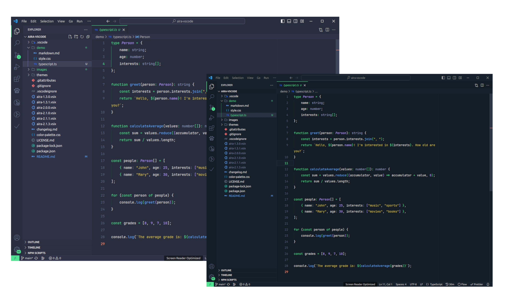
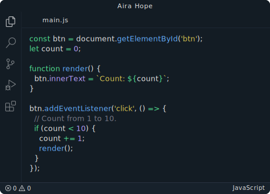
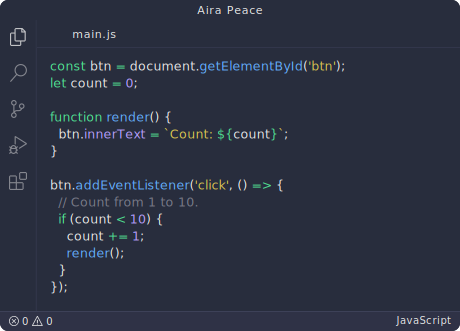

# Aira Theme

Aira injects energy and joy into your workflow, elevating your creativity to new heights.

  

[][marketplace]
[][marketplace]
[][marketplace]

## Installation

1. Open the extensions sidebar on Visual Studio Code
2. Search for **Aira Theme** by Tálison Cardoso
3. Click Install to install it.
4. Click Reload to reload your editor.
5. Code/File ＞ Preferences ＞ Color Theme ＞ Aira.

### Aira Hope

### Aira Peace

[marketplace]: https://marketplace.visualstudio.com/items?itemName=TalisonCardoso.aira